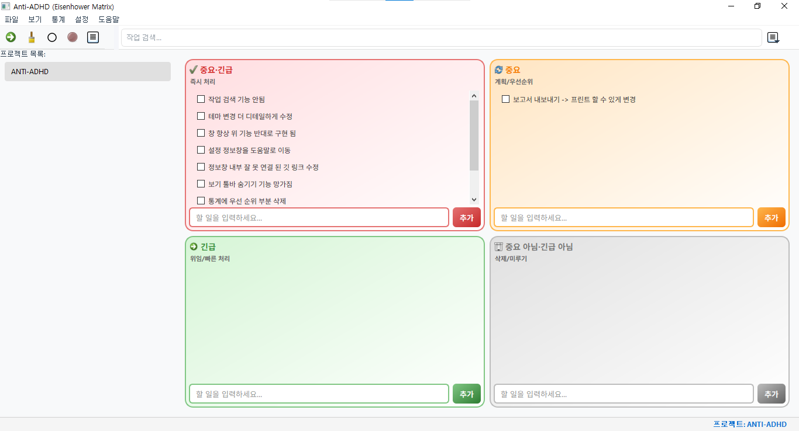

# ANTI-ADHD: 4분할 체크리스트 관리 도구

> **당신의 생각에 구조를, 하루에 질서를 부여하는 도구**

<p align="center">
  
</p>

## 📌 소개

**ANTI-ADHD**는 아이젠하워 매트릭스를 기반으로 한 할 일 관리 도구입니다. ADHD가 있는 사용자를 위해 특별히 설계되었으며, 중요도와 긴급도에 따라 할 일을 효과적으로 관리하도록 도와드립니다.

## 💫 동기

> **당신의 혼돈 속에서 질서를, 불확실함 속에서 명확함을 찾아드립니다.**

ADHD와 함께하는 삶이 얼마나 도전적인지 깊이 이해합니다. 번쩍이는 생각들이 끊임없이 흘러가고, 시작한 일들은 마무리되지 못한 채 방치되며, 시간은 손가락 사이로 모래처럼 빠져나가는 느낌, 이 모든 것이 당신의 일상이 될 수 있다는 것을 알고 있습니다.

이 프로젝트는 단순한 도구 이상의 의미를 담고 있습니다. 이것은 **당신의 잠재력을 온전히 발현시키기 위한 헌신적인 동반자**입니다.

아이젠하워 매트릭스를 기반으로 한 이 투두 리스트는 복잡한 세계를 네 가지 명확한 카테고리로 단순화합니다:

- **중요하고 긴급한 일** — 즉시 조치가 필요한 핵심 과제
- **중요하지만 긴급하지 않은 일** — 장기적 성장과 발전을 위한 활동
- **긴급하지만 덜 중요한 일** — 위임하거나 최소화할 수 있는 일
- **둘 다 아닌 일들** — 과감히 제거할 수 있는 시간 낭비 요소

이 구분은 산만함으로 고통받는 마음에 평화를 가져다 줍니다.

## 🔍 우리가 해결하고자 하는 문제

- ⚠️ **할 일의 우선순위 결정의 어려움**
- 🔄 **작업 전환 시 집중력 저하**
- ⏳ **중요한 일을 미루는 경향**
- 📊 **과도한 멀티태스킹**
- ⏰ **시간 관리의 어려움**
- 📝 **일상적인 계획 수립의 어려움**

## 💡 우리의 해결책

아이젠하워 매트릭스를 기반으로 한 이 투두 리스트는 복잡한 세계를 네 가지 명확한 카테고리로 단순화합니다:

| | **긴급함** | **긴급하지 않음** |
|---|---|---|
| **중요함** | 즉시 하기 | 계획 세우기 |
| **중요하지 않음** | 위임하기 | 제거하기 |

이 구분은 산만함으로 고통받는 마음에 평화를 가져다 줍니다.

## 🤝 우리의 약속

**우리는 당신이 계획을 세우고, 실행하고, 완성하는 모든 순간을 응원합니다.** 작은 승리의 순간들이 모여 큰 성취가 될 것입니다. 당신의 뇌가 작동하는 독특한 방식을 이해하고, 그것을 강점으로 전환시키기 위해 이 여정을 시작했습니다.

실패하는 날들이 있을 것입니다. 계획이 무너지고, 집중력이 흩어지는 순간들도 있을 것입니다. 하지만 이것은 여정의 일부일 뿐, 당신의 가치를 정의하지 않습니다. 다시 일어나, 매트릭스로 돌아오세요. **우리는 항상 여기 있을 것입니다.**

당신의 혼돈 속에서 질서를 찾고, 당신의 열정에 방향을 제시하며, 당신의 꿈을 현실로 만드는 이 여정에 함께하게 되어 영광입니다.

이 도구가 당신의 삶에 작은 변화를 가져오길 바랍니다. 그리고 그 작은 변화들이 모여, 당신이 상상했던 것보다 더 크고 의미 있는 변화로 이어지길 진심으로 소망합니다.

**함께 걸어가겠습니다. 한 걸음, 한 작업, 하루하루씩.**

## ✨ 주요 기능

### 핵심 기능

- **📊 4분할 체크리스트**
  - **중요 & 긴급**: 즉시 처리해야 하는 일
  - **중요**: 계획을 세워 처리할 일
  - **긴급**: 빠르게 처리해야 하는 일
  - **중요 X 긴급 X**: 나중에 처리해도 되는 일

- **💾 자동 저장 시스템**
  - 5분 간격 자동 저장
  - 수동 저장/불러오기 지원
  - 안정적인 데이터 백업

- **📝 메모 관리**
  - 항목별 상세 메모 기능
  - 메모 존재 시 * 표시
  - 메모 자동 저장

### 편의 기능

- **🪟 창 관리**
  - 항상 위에 표시 기능
  - 투명도 조절 (20-100%)
  - 깔끔한 UI/UX

- **🖨️ 프린트 기능**
  - 브라우저 기반 깔끔한 출력
  - 사용자 정의 레이아웃
  - 체크리스트 백업

## 🔧 설치 및 사용

### 다운로드

[Windows 실행 파일 다운로드](https://github.com/octxxiii/Anti-ADHD/releases/latest/download/ANTI_ADHD.exe)

### 상세 사용 설명서

자세한 사용 방법은 [사용 설명서](https://octxxiii.github.io/Anti-ADHD/)를 참고하세요.

### 직접 빌드하기

```bash
# 저장소 클론
git clone https://github.com/octxxiii/Anti-ADHD.git
cd Anti-ADHD

# 가상환경 설정
python -m venv .venv
.venv/Scripts/activate  # Windows
source .venv/bin/activate  # Mac/Linux

# 패키지 설치
pip install -r requirements.txt

# 실행 파일 생성
pyinstaller --noconfirm --onefile --windowed --icon=app_icon.ico --name=ANTI_ADHD anti_adhd.py
```

## 📘 사용 방법

### 항목 관리

1. **추가**: 각 분면의 입력창에 텍스트 입력 후 Enter 또는 추가 버튼
2. **수정**: 항목 우클릭 후 수정 선택
3. **삭제**: 항목 우클릭 후 삭제 선택
4. **완료**: 체크박스 클릭으로 완료 표시

### 메모 관리

1. **추가**: 항목 더블클릭 또는 우클릭 후 상세보기 선택
2. **수정**: 메모 창에서 직접 수정
3. **삭제**: 메모 내용을 모두 지우고 저장

### 데이터 관리

- **자동 저장**: 5분마다 자동으로 저장
- **수동 저장**: 설정 메뉴에서 저장/불러오기
- **프린트**: 현재 체크리스트 인쇄

## 📖 상세 설명서

### 1. 시작하기

#### 1.1 프로그램 실행
- 다운로드한 `ANTI_ADHD.exe` 파일을 더블클릭하여 실행합니다.
- 프로그램이 처음 실행되면 자동으로 기본 데이터 파일이 생성됩니다.

#### 1.2 기본 화면 구성
- **상단**: 제목 표시줄 (프로그램 이름)
- **중앙**: 4분할 체크리스트 영역
- **하단**: 설정 메뉴 (저장, 불러오기, 투명도 조절, 고정 기능)

### 2. 체크리스트 사용법

#### 2.1 항목 추가
1. 원하는 분면의 입력창에 텍스트를 입력합니다.
2. Enter 키를 누르거나 추가 버튼을 클릭합니다.
3. 항목이 해당 분면에 추가됩니다.

#### 2.2 항목 관리
- **수정**: 항목을 우클릭하고 "수정"을 선택합니다.
- **삭제**: 항목을 우클릭하고 "삭제"를 선택합니다.
- **완료**: 체크박스를 클릭하여 완료 표시를 합니다.

#### 2.3 메모 기능
- **메모 추가**: 항목을 더블클릭하거나 우클릭 후 "상세보기"를 선택합니다.
- **메모 수정**: 메모 창에서 직접 텍스트를 수정합니다.
- **메모 삭제**: 메모 내용을 모두 지우고 저장합니다.
- **메모 표시**: 메모가 있는 항목은 * 표시가 됩니다.

### 3. 데이터 관리

#### 3.1 자동 저장
- 프로그램은 5분마다 자동으로 데이터를 저장합니다.
- 저장된 데이터는 `data.json` 파일에 저장됩니다.

#### 3.2 수동 저장/불러오기
- **저장**: 설정 메뉴에서 "저장"을 클릭합니다.
- **불러오기**: 설정 메뉴에서 "불러오기"를 클릭합니다.
- **백업**: 수동으로 `data.json` 파일을 복사하여 백업할 수 있습니다.

#### 3.3 프린트 기능
1. 설정 메뉴에서 "프린트"를 클릭합니다.
2. 브라우저에서 체크리스트가 열립니다.
3. 브라우저의 인쇄 기능(Ctrl+P)을 사용하여 인쇄합니다.

### 4. 설정 옵션

#### 4.1 창 관리
- **항상 위에 표시**: 설정 메뉴에서 "고정" 버튼을 클릭합니다.
- **투명도 조절**: 슬라이더를 사용하여 20-100% 사이로 조절합니다.

#### 4.2 자동 저장 설정
- 자동 저장은 기본적으로 활성화되어 있습니다.
- 설정 메뉴에서 자동 저장을 비활성화할 수 있습니다.

### 5. 문제 해결

#### 5.1 일반적인 문제
- **프로그램이 실행되지 않음**: 관리자 권한으로 실행해보세요.
- **데이터가 저장되지 않음**: 프로그램이 설치된 폴더에 쓰기 권한이 있는지 확인하세요.
- **메모가 사라짐**: 자동 저장이 완료될 때까지 기다리세요.

#### 5.2 데이터 복구
1. `data.json` 파일의 백업이 있는 경우 복사하여 붙여넣습니다.
2. 백업이 없는 경우 마지막 자동 저장 시점의 데이터를 사용합니다.

### 6. 최적의 사용 방법

#### 6.1 일일 계획
- 아침에 각 분면의 우선순위를 설정합니다.
- 긴급한 일은 즉시 처리하고, 중요한 일은 계획을 세웁니다.
- 하루가 끝날 때 완료된 항목을 확인합니다.

#### 6.2 주간 계획
- 매주 시작할 때 장기적인 목표를 설정합니다.
- 중요하지만 긴급하지 않은 일에 집중합니다.
- 주간 리뷰를 통해 진행 상황을 확인합니다.

#### 6.3 생산성 팁
- 한 번에 한 분면에 집중합니다.
- 메모를 활용하여 상세한 정보를 기록합니다.
- 정기적으로 완료된 항목을 정리합니다.

## 💻 시스템 요구사항

- Windows 10 이상
- 최소 50MB 저장 공간

## 👨‍💻 개발 정보

- **버전**: 1.0.1
- **개발자**: OctXXIII
- **이메일**: kdyw123@gmail.com

## 📜 라이선스

MIT License

## 🤝 기여하기

버그 리포트나 기능 제안은 [Issues](https://github.com/octxxiii/Anti-ADHD/issues)를 통해 환영합니다.

## 📋 업데이트 내역

- **2024-04-29**: v1.0.1 릴리즈
  - 메모 저장 로직 개선
  - 자동 저장 기능 추가
  - UI/UX 개선

## 📞 연락처

프로젝트에 대한 문의나 제안이 있으시면 [kdyw123@gmail.com](mailto:kdyw123@gmail.com)으로 연락주세요.

---

<p align="center">
  <b>ANTI-ADHD</b> — 당신의 생각에 구조를, 하루에 질서를 부여하는 도구
</p>
